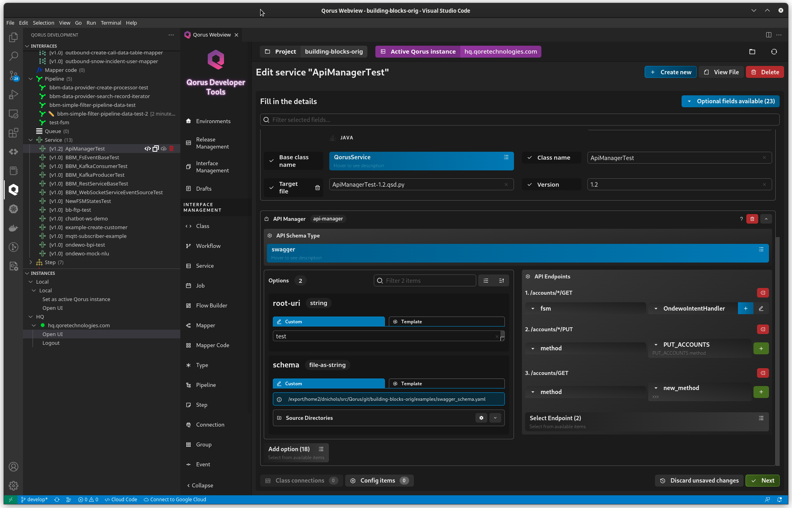
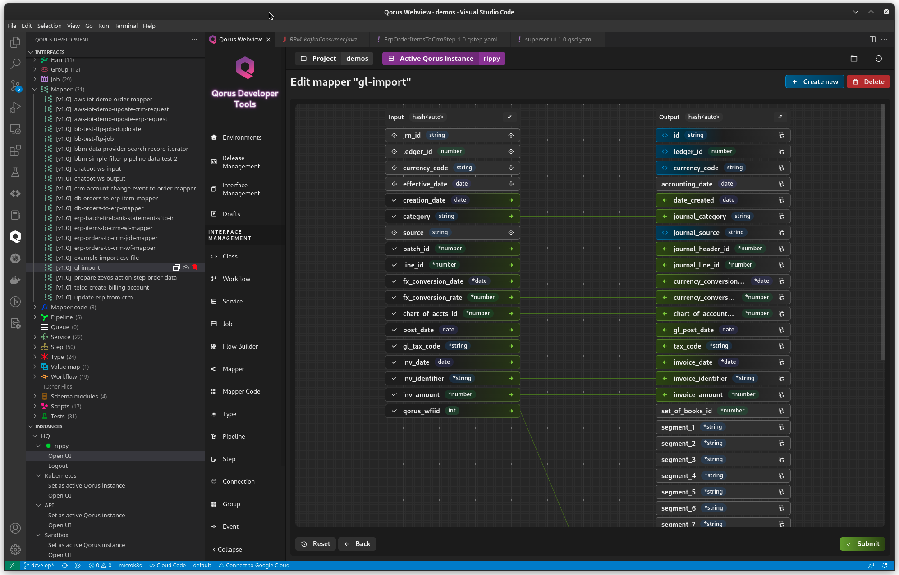
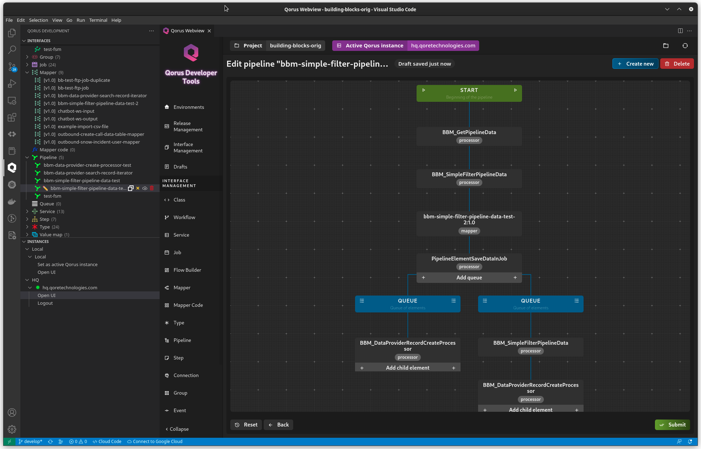
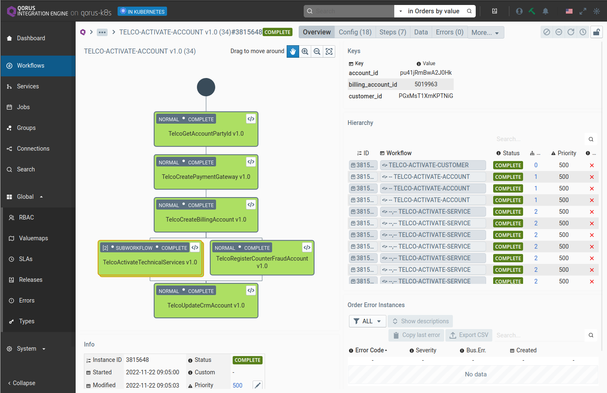

# Qorus Integration Engine(R) Community Edition

Qorus is a IT integration and automation platform designed to be a "no-code platform for coders" - as it enables coding and working with reusable no-code objects - to reduce the risk and cost of IT automation and integration work while allowing dev teams to work with the approach that it most natural to them.

Documentation: https://qoretechnologies.com/manual/qorus-ce/current/qorus/

Discord: https://discord.gg/wz9qBxrh

## IDE

The Qorus IDE can be installed directly in Microsoft VS Code: https://marketplace.visualstudio.com/items?itemName=qoretechnologies.qorus-vscode - by using VS Code, Qorus supports coding as well as GUI-driven no-code integration functionality.





## Use Cases

Qorus Integration Engine(R) is suitable for data integration scenarios as well as IT process orchestration and more.

Qorus supports the full lifecycle management of IT integration and automation solutions as well as CI/CD through its support for testing and automated release packaging and installation.

## Programming Languages

While Qorus is written in [Qore](https://github.com/qorelanguage/qore), it also supports Java and Python, as well as tight runtime integration between all three languages.  Qore provides the functionality of a "language bridge", which enables Python to dynamically import Qore and Java APIs and use them as if they were Python APIs, and Java as well can dynamically import Qore and Python APIs and use them as if they were Java APIs.

Due to Qorus's support for both Python and Java, Qorus can be used to connect enterprise technologies and data based on Java with data science and AI solutions in Python.

## Building

Qorus requires the [Qore Programming Language](https://github.com/qorelanguage/qore) and several modules to build:
- [fsevent](https://github.com/qorelanguage/module-fsevent)
- [jni](https://github.com/qorelanguage/module-jni)
- [json](https://github.com/qorelanguage/module-json)
- [linenoise](https://github.com/qorelanguage/module-linenoise)
- [magic](https://github.com/qorelanguage/module-magic)
- [msgpack](https://github.com/qorelanguage/module-msgpack)
- [mysql](https://github.com/qorelanguage/module-mysql)
- [odbc](https://github.com/qorelanguage/module-odbc)
- [openldap](https://github.com/qorelanguage/module-openldap)
- [oracle](https://github.com/qorelanguage/module-oracle)
- [pgsql](https://github.com/qorelanguage/module-pgsql)
- [process](https://github.com/qorelanguage/module-process)
- [python](https://github.com/qorelanguage/module-python)
- [ssh2](https://github.com/qorelanguage/module-ssh2)
- [sybase](https://github.com/qorelanguage/module-sybase)
- [sysconf](https://github.com/qorelanguage/module-sysconf)
- [uuid](https://github.com/qorelanguage/module-uuid)
- [xml](https://github.com/qorelanguage/module-xml)
- [xmlsec](https://github.com/qorelanguage/module-xmlsec)
- [yaml](https://github.com/qorelanguage/module-yaml)
- [zmq](https://github.com/qorelanguage/module-zmq)

Once these are all installed and working, then you need to set the `OMQ_DIR` environment variable to the root directory of your new Qorus installation, and then you can use cmake to build Qorus:
```
mkdir build
cd build
cmake ..
make install
```

Then you will need to provide access to a DB schema in a PostgreSQL (recommended - driver name `pgsql`), MySQL/MariaDB (not well tested, driver name `mysql`), or Oracle (very well tested, driver name `oracle`) DB schema.

The DB schema needs to be set in the `qorus.systemdb` option in the `$OMQ_DIR/etc/options` file - ex: `qorus.systemdb: pgsql:omq/omq@omq` (format: `<driver>:[<user>/<pass>]@<db>[(<charset>)][%<host>[:<port>][{<option>=<val>[,...]}]`; see [parse_datasource()](https://qoretechnologies.com/manual/qorus-ce/current/qore/lang/html/group__dbi__functions.html#ga5bc0c2cfb4f1bfbf73c527f9441a6dbe) for more information).

Once the `qorus.systemdb` option is set, then the schema can be created with `schema-tool -Vv`.

## UI

The system UI must be installed manually as follows:
```
cd $OMQ_DIR
wget https://hq.qoretechnologies.com/~pchalupny/ui-builds/qorus-webapp-develop.zip
unzip qorus-webapp-develop.zip
mv develop/webapp .
rmdir develop
```



## Options File

The `$OMQ_DIR/etc/options` file has many options that can be set; see [Qorus system options](https://qoretechnologies.com/manual/qorus-ce/current/qorus/systemoptions.html) for more information.

Some important options are:
- `qorus.instance-key`: the name of the qorus instance: https://qoretechnologies.com/manual/qorus-ce/current/qorus/systemoptions.html#instance-key
- `qorus.http-secure-server`: to configure an HTTPS listener, required for sensitive data APIs, for example; see https://qoretechnologies.com/manual/qorus-ce/current/qorus/operations.html#ops_sensitive_data_https for more info

## Start Qorus

To start Qorus after setting up the schema and installing the UI, type: `qctl start` - you should get output like:
```
starting Qorus Integration Engine(R) Community Edition v6.0.0_dev (build cdac6dcfa83a89156c4bec45fd67145a92dab715)
 + qorus-core: starting instance test-ce on omqce@omqce (pgsql) with session ID 9
 + qorus-core: system starting at 2023-02-08 21:40:27.780688
 + qorus-core: auditing: [] = auditing disabled
 + qorus-core: starting HTTP listener on: /tmp/qorus-sock-test-ce
 + qorus-core: starting HTTPS listener on: <all interfaces>:8011
 + qorus-core: HTTP listener 0 started on unix:/tmp/qorus-sock-test-ce
cluster started; qorus-core running with PID 56156
```

## Docker

Docker images can be built with the included Dockerfiles - ex:
- `docker build . -f ./ubuntu.dockerfile`
- `docker build . -f ./alpine.dockerfile`
- `docker build . -f ./alpine-minimal.dockerfile`

For more information on Docker images for Qorus, see:
- https://github.com/qoretechnologies/qorus-docker
- https://gallery.ecr.aws/qorus (note that `qorus-ce*` repositories are for the open-source Community Edition, `qorus-ee*` are for the closed-source Enterprise Edition)

## Platforms

Qorus has been extensively tested on Linux and macOS on x86_64 and aarch64 processors.  As Qore supports many more processors than those two, Qorus should run fine on any supported CPU architecture as long as Qore and all modules are available.
